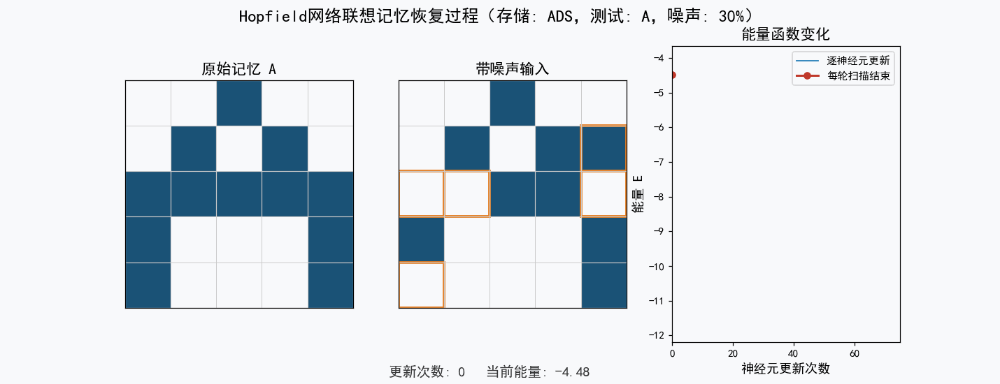
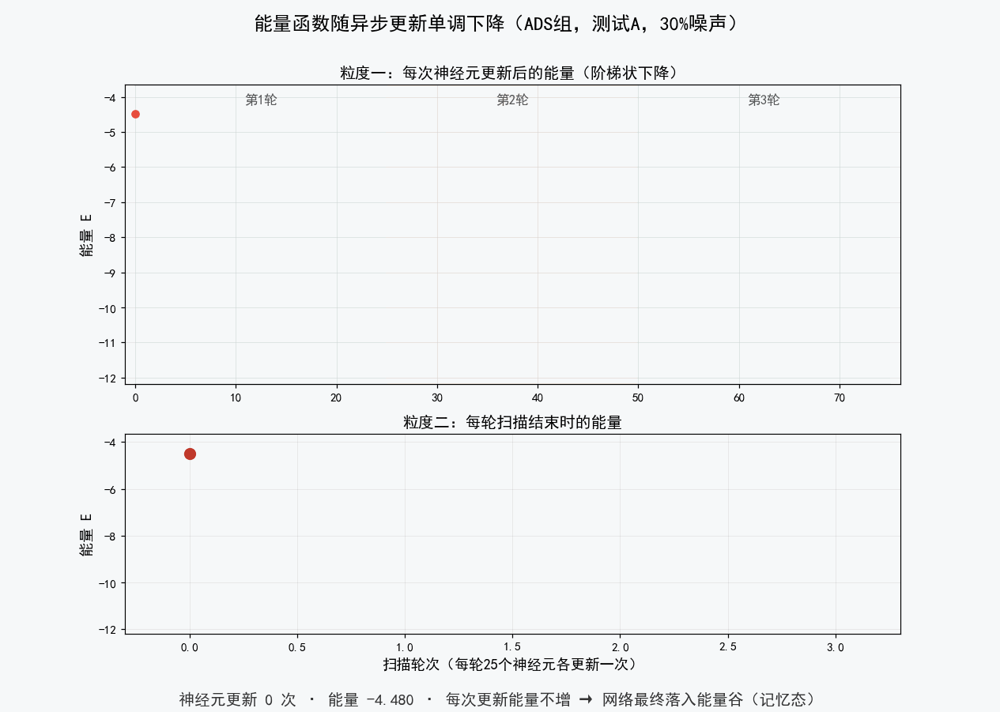
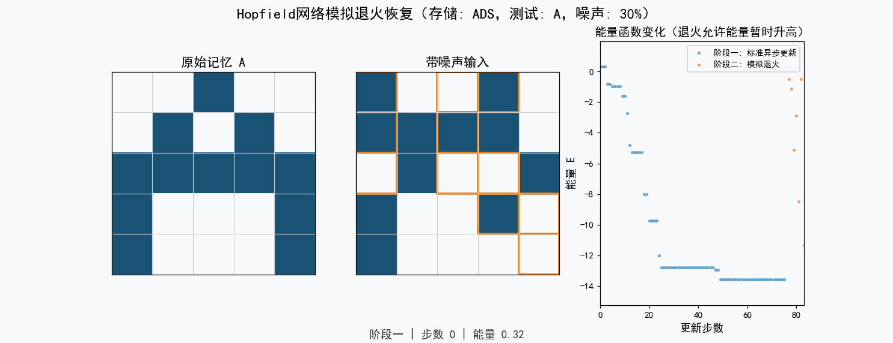
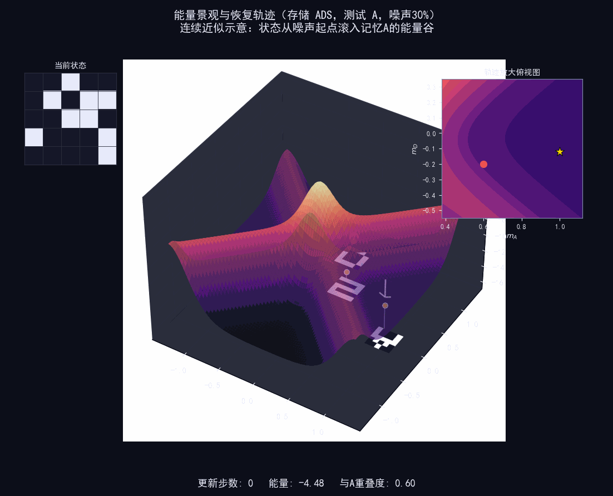

# Hopfield 网络的 C 语言实现

用 C 语言实现离散 **Hopfield 网络**，完成对 26 个英文字母（A–Z）图案的**联想记忆**：存储若干字母图案后，输入一个带噪声的图案，网络能通过异步更新逐步收敛、恢复到正确的字母。

这是我在物理学习中研究神经网络联想记忆时写的一组程序，从最基础的 5×5 网格逐步扩展到任意尺寸输入、过采样标准化、动态网格测量和模拟退火。

## 原理简述

- **神经元状态**：每个像素是一个神经元，取值为 `+1`（实心）或 `-1`（空白）。
- **权重学习**：用 Hebb 规则 `J = Σ ξᵢξⱼ / N` 一次性学习要存储的字母图案。
- **异步更新**：随机顺序逐个更新神经元 `Sᵢ = sign(Σ Jᵢⱼ Sⱼ)`，直到状态不再变化（收敛到能量局部极小点）。
- **联想记忆**：输入带噪声的图案，网络沿能量函数下降方向收敛，恢复出最接近的记忆图案。

## 目录结构

```text
Hopfield-Network-C/
├── README.md                   项目说明
├── LICENSE                     MIT 开源许可证
├── src/                        源代码
│   ├── hopfield_basic.c        最基础的 5×5 网格版本
│   ├── hopfield_6x6.c          6×6 网格版本
│   ├── hopfield_dynamic_grid.c 动态网格（任意尺寸 → 5×5 归一化）
│   ├── hopfield_measurement.c  动态网格数据测量
│   ├── hopfield_oversampling.c 过采样标准化 + 热力图 / CSV 输出
│   └── hopfield_annealing.c    模拟退火
├── docs/
│   └── 代码.docx               原始说明文档
└── visualization/              Python 可视化（动画演示 + 生成脚本）
    ├── hopfield_visualize.py   一键生成全部动画/图片的自包含脚本
    ├── gif1_pattern_recovery.gif   图案恢复过程
    ├── gif2_energy_descent.gif     能量函数单调下降
    ├── gif3_annealing_recovery.gif 模拟退火恢复
    ├── gif4_energy_landscape.gif   3D 能量景观动画
    └── fig_energy_landscape.png    静态 3D 能量景观图
```

## 文件说明

| 文件 | 说明 | 对应原始文件 |
| ------ | ------ | -------------- |
| `src/hopfield_basic.c` | 最基础的 5×5 网格版本，交互式加噪恢复，含成功率批量测试 | `Hopfield程序.cpp` |
| `src/hopfield_6x6.c` | 6×6 网格版本，分辨率更高，识别更清晰 | `Hopfield程序36.cpp` |
| `src/hopfield_dynamic_grid.c` | 动态网格：接受任意尺寸（如 8×8、20×20）输入，用对称双线性插值归一化到 5×5 再恢复 | `动态网格2.0.cpp` |
| `src/hopfield_measurement.c` | 动态网格数据测量：批量统计不同输入尺寸 / 噪声下的恢复成功率 | `动态网格数据测量2.0.cpp` |
| `src/hopfield_oversampling.c` | 过采样标准化：小尺寸用最近邻、大尺寸用双线性，输出成功率热力图与 CSV 数据 | `过采样数据测量.cpp` |
| `src/hopfield_annealing.c` | 模拟退火：在标准恢复陷入局部极小（错配字母）时，用退火跳出局部极小 | `退火.cpp` |

> 各版本的核心算法相同，区别在于**输入图案的生成/归一化方式**和**恢复策略**，体现了我对「如何让 Hopfield 网络在更复杂输入下仍能正确联想」的逐步探索。

## 编译

所有文件均为纯 C，可用任一 C 编译器编译。代码使用了 C99 语法（`for` 循环内声明变量），编译时需指定 C99 或更新标准。以 GCC 为例，在 `src/` 目录下执行：

```bash
# 基础 5×5 版
gcc -std=c99 -O2 -o hopfield_basic hopfield_basic.c

# 6×6 版
gcc -std=c99 -O2 -o hopfield_6x6 hopfield_6x6.c

# 动态网格版
gcc -std=c99 -O2 -o hopfield_dynamic_grid hopfield_dynamic_grid.c

# 动态网格测量版
gcc -std=c99 -O2 -o hopfield_measurement hopfield_measurement.c

# 过采样测量版
gcc -std=c99 -O2 -o hopfield_oversampling hopfield_oversampling.c

# 模拟退火版（用到 exp，需链接数学库 -lm）
gcc -std=c99 -O2 -o hopfield_annealing hopfield_annealing.c -lm
```

> 若你的 GCC 较新（5.x 及以上），`-std=c99` 可省略（新版默认即为较新的 C 标准），加上也无妨。
> 在 Windows 上编译后生成 `.exe` 可执行文件，运行命令相应为 `hopfield_basic.exe` 等。

## 运行

以基础版为例：

```text
$ ./hopfield_basic
请输入要存储的字母（如 ACT 或 ABCDE）: ABCDE
请选择模式:
  1. 交互式测试（可视化过程）
  2. 批量测试（统计成功率）
请输入选择 (1 或 2): 1
请选择要测试的字母（必须在存储列表中）: A
```

程序会依次打印：原始图案 → 加 30% 噪声后的图案 → 恢复后的图案，并报告是否成功恢复。

## 输入噪声水平

默认加噪率 `NOISE_RATE = 0.3`（30% 的像素被翻转）。可通过修改源文件顶部的 `#define NOISE_RATE` 调整，观察不同噪声下网络的恢复能力。

## 可视化

仓库附带与 C 实现配套的 Python 可视化脚本 `visualization/hopfield_visualize.py`，算法细节与 `src/hopfield_basic.c`、`src/hopfield_annealing.c` 精确一致（异步更新边界、收敛判据、退火降温流程均逐条对应），可一键复现下列全部动画。

**依赖**：Python 3 + `numpy`、`matplotlib`、`Pillow`（`scipy` 可选，安装后 3D 曲面更细腻）：

```bash
pip install numpy matplotlib pillow
```

**运行**（在 `visualization/` 目录下）：

```bash
python hopfield_visualize.py          # 生成全部 4 个 GIF + 1 张静态图，约 5~10 分钟
python hopfield_visualize.py --quick  # 仅生成前两个基础 GIF，约 1 分钟
```

结果输出到 `visualization/output/`。案例与实验报告一致：存储 A / D / S 三个字母，测试 A，加 30% 噪声。

### 效果预览

**① 图案恢复过程**——带 30% 噪声的输入经异步更新逐步收敛为记忆图案：



**② 能量函数单调下降**——每次神经元更新都使能量下降，收敛到能量局部极小点：



**③ 模拟退火**——标准更新陷入非字母伪态后，退火允许能量暂时升高以跳出局部极小，最终恢复目标字母：



**④ 3D 能量景观**——记忆存储为能量谷，状态沿下降方向滚入最近的谷（曲面为连续近似示意，谷底位置与严格离散计算一致）：



## 许可证

本项目采用 [MIT License](LICENSE) 开源。
